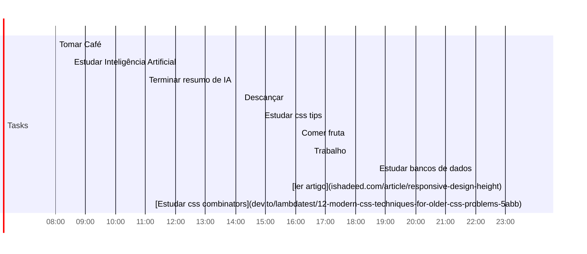

## Day Planner

## Manhã
- [x] 08:00 Tomar Café
- [x] 08:30 Estudar Inteligência Artificial
- [x] 11:00 Terminar resumo de IA

## Tarde
- [x] 14:10 Descançar
- [x] 14:50 Estudar css tips
- [x] 16:05 Comer fruta
- [ ] 16:30 Trabalho

## Noite
- [ ] 18:40 Estudar bancos de dados
- [ ] 23:00 [ler artigo](ishadeed.com/article/responsive-design-height)
- [ ] 23:40 [Estudar css combinators](dev.to/lambdatest/12-modern-css-techniques-for-older-css-problems-5abb)